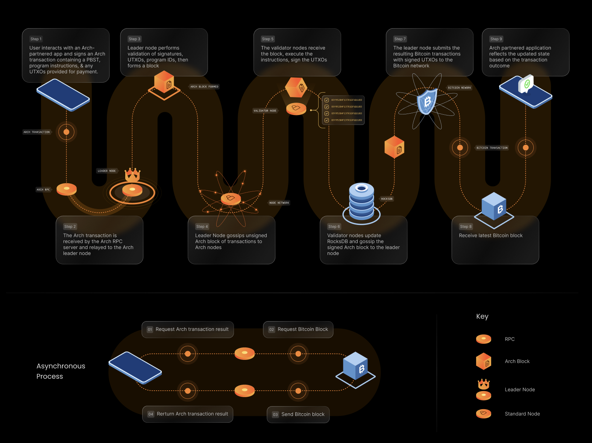

# Step-by-Step User Journey

The following details a user journey for an Arch transaction.

1. Users can invoke a program by preparing, signing, and sending a transaction to the Arch Network without having to use anything but their Bitcoin wallets (ie, no bridging). 

    They send this message through an RPC call passing essential information for execution, including State UTXOs, the related programs to execute, and custom program inputs (Bitcoin PSBTs).

2. A leader node, selected from the pool of validators, receives the RuntimeTransaction and initiates the process by proposing a new block. The transaction is then gossiped throughout the network whereby each validator will validate and process the transaction asynchronously.

3. Execution results are shared back with the leader node and, once a signature threshold is reached, the leader will aggregate the signatures and sends a fully-signed Bitcoin transaction to the Bitcoin network, including state transitions and asset transfers from the execution (this guarantees that you can’t have the asset transfer happen without the state transition also occurring, or vice versa).

4. The user, or dapp, can then poll the network to retrieve the result of the transaction.

<!-- credits: https://stackoverflow.com/a/45191209/7253829 -->
|  |
|:--:| 
| *An example journey of an Arch transaction* |
